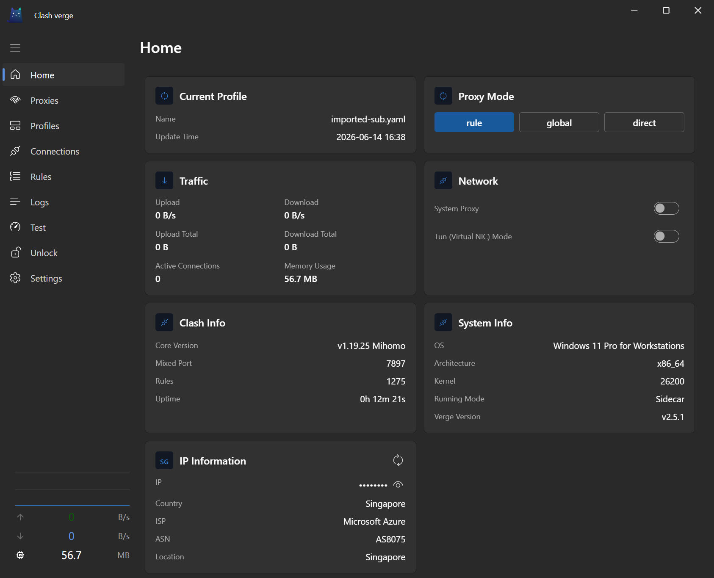
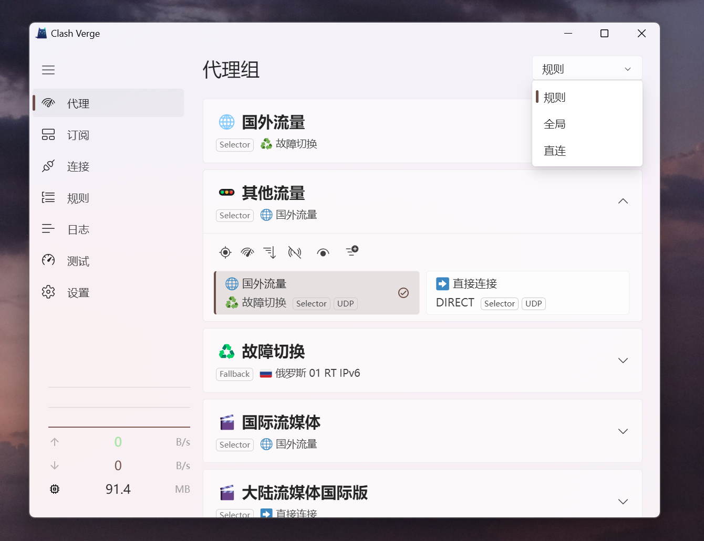

<h1 align="center">
  
  <br>
  Continuation of <a href="https://github.com/zzzgydi/clash-verge">Clash Verge</a>
  <br>
</h1>

<h3 align="center">
Clash Meta GUI базируется на <a href="https://github.com/tauri-apps/tauri">Tauri</a>.
</h3>

<p align="center">
  Языки:
  <a href="../README.md">简体中文</a> ·
  <a href="./README_en.md">English</a> ·
  <a href="./README_es.md">Español</a> ·
  <a href="./README_ru.md">Русский</a> ·
  <a href="./README_ja.md">日本語</a> ·
  <a href="./README_ko.md">한국어</a> ·
  <a href="./README_fa.md">فارسی</a>
</p>
## Предпросмотр

| Тёмная тема                        | Светлая тема                         |
| ---------------------------------- | ------------------------------------ |
|  |  |

## Установка

Пожалуйста, перейдите на страницу релизов, чтобы скачать соответствующий установочный пакет: [Страница релизов](https://github.com/solywsh/clash-verge-rev-fluent/releases)<br>
Перейти на [Страницу релизов](https://github.com/solywsh/clash-verge-rev-fluent/releases) to download the corresponding installation package<br>
Поддержка Windows (x64/x86), Linux (x64/arm64) и macOS 10.15+ (intel/apple).

#### Как выбрать дистрибутив?

| Версия                | Характеристики                                                                                          | Ссылка                                                                                |
| :-------------------- | :------------------------------------------------------------------------------------------------------ | :------------------------------------------------------------------------------------ |
| Stable                | Официальный релиз, высокая надежность, подходит для повседневного использования.                        | [Release](https://github.com/solywsh/clash-verge-rev-fluent/releases)                 |
| Alpha(неиспользуемый) | Тестирование процесса публикации.                                                                       | [Alpha](https://github.com/solywsh/clash-verge-rev-fluent/releases/tag/alpha)         |
| AutoBuild             | Версия с постоянным обновлением, подходящая для тестирования и обратной связи. Может содержать дефекты. | [AutoBuild](https://github.com/solywsh/clash-verge-rev-fluent/releases/tag/autobuild) |

#### Инструкции по установке и ответы на часто задаваемые вопросы можно найти на [странице документации](https://clash-verge-rev.github.io/)

### TG канал: [@clash_verge_rev](https://t.me/clash_verge_re)

---

## Фичи

- Основан на произвоительном Rust и фреймворке Tauri 2
- Имеет встроенное ядро [Clash.Meta(mihomo)](https://github.com/MetaCubeX/mihomo) и поддерживает переключение на ядро версии `Alpha`.
- Чистый и эстетичный пользовательский интерфейс, поддержка настраиваемых цветов темы, значков прокси-группы/системного трея и `CSS Injection`。
- Управление и расширение конфигурационными файлами (Merge и Script), подсказки по синтаксису конфигурационных файлов.
- Режим системного прокси и защита, `TUN (Tunneled Network Interface)` режим.
- Визуальное редактирование узлов и правил
- Резервное копирование и синхронизация конфигурации WebDAV

### FAQ

Смотрите [Страница часто задаваемых вопросов](https://clash-verge-rev.github.io/faq/windows.html)

### Донат

[Поддержите развитие Clash Verge Rev](https://github.com/sponsors/clash-verge-rev)

## Разработка

Дополнительные сведения смотреть в файле [CONTRIBUTING.md](../CONTRIBUTING.md).

Для запуска сервера разработки выполните следующие команды после установки всех необходимых компонентов для **Tauri**:

```shell
pnpm i
pnpm run prebuild
pnpm dev
```

## Вклад

Обращения и запросы на PR приветствуются!

## Благодарность

Clash Verge rev был основан на этих проектах или вдохновлен ими, и так далее:

- [zzzgydi/clash-verge](https://github.com/zzzgydi/clash-verge): Графический интерфейс Clash на основе tauri. Поддерживает Windows, macOS и Linux.
- [tauri-apps/tauri](https://github.com/tauri-apps/tauri): Создавайте более компактные, быстрые и безопасные настольные приложения с веб-интерфейсом.
- [Dreamacro/clash](https://github.com/Dreamacro/clash): Правило-ориентированный туннель на Go.
- [MetaCubeX/mihomo](https://github.com/MetaCubeX/mihomo): Правило-ориентированный туннель на Go.
- [Fndroid/clash_for_windows_pkg](https://github.com/Fndroid/clash_for_windows_pkg): Графический интерфейс пользователя для Windows/macOS на основе Clash.
- [vitejs/vite](https://github.com/vitejs/vite): Инструменты нового поколения для фронтенда. Они быстрые!

## Лицензия

GPL-3.0 License. Подробности смотрите в [Лицензии](../LICENSE).
